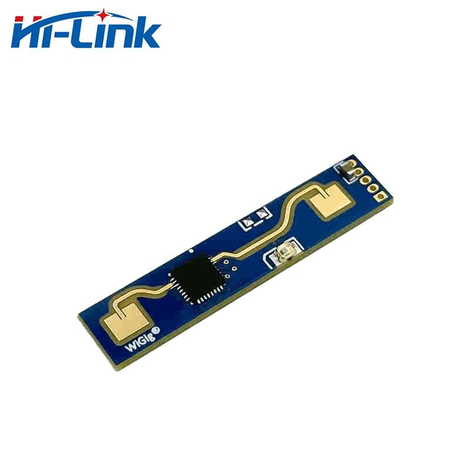

# LD2410X Sensor API

[](https://github.com/seiiinoth/ld2410x-api/actions/workflows/build_test.yml)

<a href="https://www.hlktech.net/index.php?id=1094">
  
</a>

The LD2410 is an advanced 24GHz radar module designed to detect human presence within a designated area. Developed by Hi-link Electronics, this innovative device employs Frequency-Modulated Continuous Wave (FMCW) technology to accurately identify human targets, both in motion and stationary positions. By combining sophisticated radar signal processing with precise human body sensing algorithms, the LD2410 offers high-sensitivity presence detection capabilities.

In addition to detecting human presence, this module can calculate auxiliary information, such as the distance to the target, providing valuable insights for various applications. With a maximum sensing range of up to 5 meters and an adjustable distance resolution of 0.2/0.75 meters, the LD2410 is ideally suited for indoor environments where monitoring human movement or presence is critical.

One of the key features of this module is its user-friendly visual configuration tool, which allows for easy customization of sensing parameters. Users can conveniently adjust the sensing distance range, sensitivity levels, and unmanned delay times to meet the specific requirements of their applications. This flexibility ensures that the LD2410 can adapt to diverse scenarios and integrate seamlessly with different smart devices and systems.

Supporting both GPIO and UART output interfaces, the LD2410 offers plug-and-play functionality, making it a versatile solution for integration into various intelligent environments and terminal products. Its real-time detection and output capabilities enable responsive and efficient monitoring, enhancing the overall user experience and promoting increased automation and convenience.

## Features

- Plug and play, easy assembly
- The farthest sensing distance is up to 5 meters
- Large detection angle, coverage up to ±60 degrees
- Accurately identify within the interval, support the division of the sensing range, and shield the interference outside the interval
- Visual debugging and configuration tools
- Small and simplified, the minimum size is only 7mmx35mm
- 24GHz ISM band, compliant with FCC and CE spectrum regulations

## Technical parameters

|                           |                                                                      |
| ------------------------- | -------------------------------------------------------------------- |
| Power Requirements        | DC 5V, Power supply capability > 200mA                               |
| Average operating current | 80 mA                                                                |
| Interface                 | 1 GPIO IO level 3.3V; 1 UART                                         |
| Detection distance        | 0.75m～5m, adjustable                                                |
| Distance resolution       | 0.2/0.75m                                                            |
| Detection angle           | ±60 °                                                                |
| Working frequency         | 24GHz~ 24.25GHz Compliant with FCC, CE, non-commission certification |
| Modulation                | FMCW                                                                 |
| Sweep Bandwidth           | 250MHz Compliant with FCC, CE, non-commission certification          |
| Ambient temperature       | -40 ~ 85 ℃                                                           |

 dimensions")

# Contributing

Contributions are welcome! Whether you want to report a bug, suggest a new feature, or submit a pull request with improvements or bug fixes, your contributions are highly appreciated.

## Development

1. **Dependencies**: The project has no third-party dependencies other than the standard system libraries
2. **Make changes**: Modify the code or documentation as needed.
3. **Test your changes**: Ensure that your changes do not break existing functionality by running the provided tests.
4. **Commit your changes**: Use descriptive commit messages that explain your changes.
5. **Push your changes**: Push your branch to your forked repository: `git push origin my-new-feature`

## Submitting a Pull Request

1. **Create a Pull Request**: Navigate to the original repository and create Pull Request.
2. **Provide a clear description**: Explain the purpose of your changes and reference any relevant issues.
3. **Review process**: Your pull request will be reviewed by the project maintainers. They may request changes or provide feedback.
4. **Addressing feedback**: If changes are requested, make the necessary updates and push them to your branch.
5. **Merging**: Once your pull request is approved, it will be merged into the main repository.

## Formatting and clang-format

This project uses [`clang-format`](https://releases.llvm.org/download.html) to standardize formatting of `.c` and `.h` files. Contributions should be formatted using `clang-format` tool:

```bash
clang-format -i *.c *.h
```

## Bug Reports

If you encounter a bug, please create a new issue in the repository's issue tracker. Provide a clear description of the problem, steps to reproduce it, and any relevant error messages or logs.

## Feature Requests

If you have an idea for a new feature or enhancement, feel free to create a new issue in the repository's issue tracker. Describe your proposed feature and explain how it would benefit the project.

## Documentation

Contributions to improve the project's documentation are also welcome. If you find any errors or areas that could be better explained, please submit a pull request with your proposed changes.

## License

By contributing to this project, you agree that your contributions will be licensed under the project's [LICENSE](LICENSE.md).

# Important links:
For more information, please refer to:

- [LD2410 Product page](https://www.hlktech.net/index.php?id=1094)
- [LD2410 User Manual](https://drive.google.com/file/d/1ZBhv4EmuiB2wA-VdW0Cx2oJJLwI_CmVn/view)
